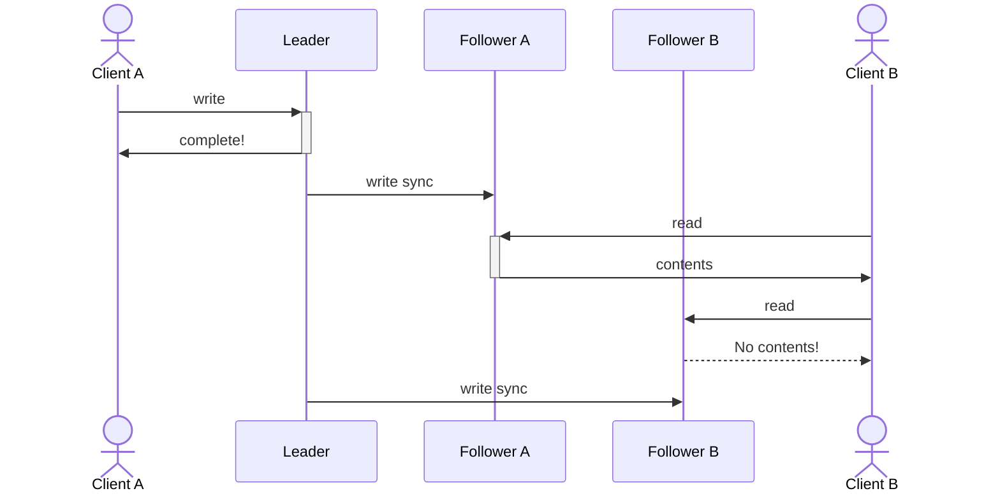
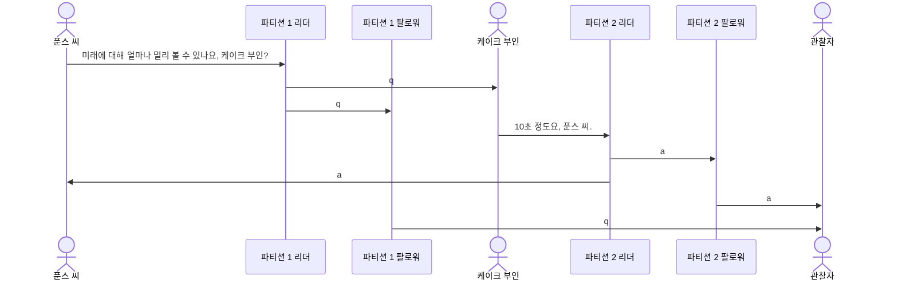

# 05장. 복제 (리더와 팔로워, 복제 지연문제, 다수 리더 복제)

복제란 네트워크로 연결된 여러 장비에 동일한 데이터의 복사본을 유지한다는 의미다. 데이터 복제가 필요한 이유는 여러가지가 있다.

- 지리적으로 사용자와 가깝게 데이터를 유지해 지연 시간을 줄인다.
- 시스템의 일부에 장애가 발생해도 지속적으로 동작할 수 있게 해 가용성을 높인다.
- 읽기 질의를 제공하는 장비의 수를 확장해 읽기 처리량을 높인다.

복제 중인 데이터가 시간이 지나도 변경되지 않는다면 복제는 쉽다. 복제에서 모든 어려움은 복제된 데이터의 변경 처리에 있으며 이것이 이번 장의 내용이다. 노드 간 변경을 복제하기 위한 세 가지 인기 있는 알고리즘을
살펴보자.

- 단일 리더(single-leader)
- 다중 리더(multi-leader)
- 리더 없는 복제(leaderless)

## 5.1 리더와 팔로워

복제 서버(replica): 데이터베이스의 복사본을 저장하는 각 노드

데이터베이스의 모든 쓰기는 모든 복제 서버에서 처리돼야 한다: 그렇지 않으면 복제 서버는 더 이상 동일한 데이터를 유지할 수 없다.

리더 기반 복제: 모든 쓰기는 리더라는 특별한 복제 서버에 전달되고, 리더는 쓰기를 처리한 후 모든 팔로워에게 쓰기를 복제한다.

### 동기식 대 비동기식 복제

동기식 복제의 장점은 팔로워가 리더와 일관성 있게 최신 데이터 복사본을 가지는 것을 보장한다. 단점은 동기 팔로워가 응답하지 않는다면
쓰기가 처리될 수 없다는 것이다. 이런 이유로 모든 팔로워가 동기식인 상황은 비현실적이다. 임의 한 노드의 장애는 전체 시스템을 멈추게 한다.

보통 리더 기반 복제는 완전히 비동기식으로 구성한다. 이런 경우 리더가 잘못되고 복구할 수 없으면 팔로워에 아직 복제되지 않은 모든 쓰기는 유실된다.
하지만 모든 팔로워가 잘못되더라도 리더가 쓰기 처리를 계속 할 수 있는 장점이 있다.

### 새로운 팔로워 설정

1. 리더의 데이터베이스 스냅숏을 일정 시점에 가져온다.
2. 스냅숏을 새로운 팔로워 노드에 복사한다.
3. 팔로워는 리더에 연결해 스냅숏 이후 발생한 모든 데이터 변경을 요청한다.
4. 팔로워가 스냅숏 이후 데이터 변경의 backlog 를 모두 처리했을 때 따라잡았다고 말한다. 이제부터 리더에 발생하는 데이터 변화를 이어 처리할 수 있다.

### 노드 중단 처리

#### 팔로워 장애: 따라잡기 복구

각 팔로워는 리더로부터 수신한 데이터 변경 로그를 로컬 디스크에 보관한다.

1. 보관된 로그에서 결함이 발생하기 전에 처리한 마지막 트랜잭션을 알아낸다.
2. 팔로워는 리더에 연결해 팔로워 연결이 끊어진 동안 발생한 데이터 변경을 모두 요청한다.

#### 리더 장애: 장애 복구

팔로워 중 하나를 새로운 리더로 승격해야 하고 클라이언트는 새로운 리더로 쓰기를 전송하기 위해 재설정이 필요하며 다른 팔로워는 새로운 리더로부터 데이터 변경을 소비하기 시작해야 한다.

1. 리더가 장애인지 판단한다.
2. 팔로워 중 하나가 새로운 리더가 되도록 선출한다.
3. 새로운 리더 사용을 위해 시스템을 재설정한다. 이전 리더가 돌아오면 여전히 자신을 리더로 믿을 수 있기 때문에 시스템은 이전 리더가 팔로워가 되고 새로운 리더를 인식할 수 있게끔 해야 한다.

장애 복구 과정은 잘못될 수 있는 것 투성이다

- 새로운 리더는 이전 리더가 실패하기 전에 이전 리더의 쓰기를 일부 수신하지 못할 수 있다. 새로운 리더가 선출된 다음 이전 리더가 다시 클러스터로 돌아온다면 충돌할 수 있다. 가장 일반적인 해결책은 이전 리더의
  복제되지 않은 쓰기를 폐기하는 방법이지만, 내구성에 대한 기대를 저버리게 된다.
- 특정 결함 시나리오에서 두 노드가 모두 자신이 리더라고 믿을 수 있다. 이런 상황을 **스플릿 브레인(split brain)** 이라고 한다.
  스플릿 브레인은 매우 위험한 상황이다. 두 노드가 동시에 쓰기를 수행하면 데이터가 불일치할 수 있다.
- 리더가 분명히 죽었다고 판단 가능한 적절한 타임아웃은 얼마일까?

이 문제에 대한 쉬운 해결책은 없다. 이런 이유로 일부 운영팀은 소프트웨어가 자동 장애 복구를 지원하더라도 수동으로 장애 복구를 수행하는 방식을 선호한다.

### 복제 노드 구현

#### 구문 기반 복제

리더는 모든 쓰기 요청(**구문(statement)**)을 기록하고 쓰기를 실행한 다음 구문 로그를 팔로워에게 전송한다.

- MySQL 5.1 이전 버전에서 사용

#### 쓰기 전 로그 배송

일반적으로 모든 쓰기는 로그에 기록한다. 완전히 동일한 로그를 사용해 다른 노드에서 복제 서버를 구축할 수 있다.
리더는 디스크에 로그를 기록하는 일 외에도 팔로워에게 네트워크로 로그를 전송하기도 한다.

팔로워가 이 로그를 처리하면 리더에서 있는 것과 정확히 동일한 데이터 구조의 복제본이 만들어진다.

- PostgreSQL, Oracle 등에서 사용

단점은 로그가 제일 저수준의 데이터를 기술하기 때문에 복제가 저장소 엔진과 밀접하게 엮이게 된다. 저장소 형식을 다른 버전으로 변경한다면
대개 리더와 팔로워의 데이터베이스 소프트웨어 버전을 다르게 실행할 수 없다.

즉, 중단시간 없이 데이터베이스 소프트웨어 업그레이드 수행이 불가능하다.

#### 논리적(로우 기반) 로그 복제

복제 로그를 저장소 엔진 내부와 분리하기 위한 대안 중 하나는 복제와 저장소 엔진을 위해 다른 로그 형식을 사용하는 것

- 삽입된 로우의 로그는 모든 칼럼의 새로운 값을 포함한다.
- 삭제된 로우의 로그는 로우를 고유하게 식별하는데 필요한 정보를 포함한다. 보통 이것은 기본키지만 테이블에 기본키가 없다면 모든 칼럼의 예전 값을 로깅해야 한다.
- 갱신된 로우의 로그는 로우를 고유하게 식별하는데 필요한 정보와 모든 칼럼의 새로운 값을 포함한다.

여러 로우를 수정하는 트랜잭션은 여러 로그 레코드를 생성한 다음 트랜잭션이 커밋됐음을 레코드에 표시한다. MySQL 의 이진 로그는 이 접근 방식을 사용한다.

논리적 로그를 저장소 엔진 내부와 분리했기 때문에 하위 호환성을 더 쉽게 유지할 수 있고 리더와 팔로워에서 다른 버전의 데이터베이스 소프트웨어나 심지어 다른 저장소 엔진을 실행할 수 있다.

또한 논리적 로그 형식은 외부 애플리케이션이 파싱하기 더 쉽다. 이런 측면은 오프라인 분석이나 사용자 정의 색인과 캐시 구축을 위해 데이터 웨어하우스 같은 외부 시스템에 데이터베이스의 내용을 전송하고자 할 때
유용하다. 이 기술을 변경 데이터 캡쳐(change data capture)라 부른다.

#### 트리거 기반 복제

트리거는 사용자 정의 애플리케이션 코드를 등록할 수 있게 한다. 이 코드는 데이터베이스 시스템에서 데이터가 변경되면 자동으로 실행된다.

트리거 기반 복제에는 다른 복제 방식보다 많은 오버헤드가 있고 버그나 제한사항이 많지만, 유연성 때문에 매우 유용하다.

## 5.2 복제 지연 문제

대부분이 읽기 요청이고 쓰기가 아주 작은 비율로 구성된 작업부하라면 많은 팔로워를 만들어 팔로워 간 읽기 요청을 분산하는 매력적인 옵션이 있다.

아쉽게도 **비동기 팔로워**에서 데이터를 읽을 때 팔로워가 뒤처진다면 지난 정보를 볼 수도 있다. 이 상황은 데이터베이스에 명백하게 불일치가 발생한다.
데이터베이스에 쓰기를 멈추고 잠시동안 기다리면 팔로워는 결국 따라잡게 되고 리더와 일치하게 된다. 이런 효과를 **최종적 일관성**이라 한다.

"최종적" 이라는 단어는 의도적으로 모호하다. 일반적으로 복제 서버가 얼마나 뒤쳐질 수 있는지에 대한 제한이 없기 때문이다. 정상적인 동작에서 리더에서 일어난 쓰기가 팔로워에게 반영되는데에 필요한 시간은 눈에 띄지
않을 정도로 짧은 시간이다. 하지만 시스템에 가용량 근처에서 동작하거나 네트워크 문제가 있으면 지연은 쉬벡 수 초에서 수 분으로 증가할 수 있다.

애플리케이션에서 지연이 매우 크면 불일치는 이론적인 문제가 아니라 실제 문제가 된다. 세 가지 사례를 살펴보고 해결 방법을 알아보자.

### 자신이 쓴 내용 읽기

사용자가 쓰기를 수행한 직후 데이터를 본다면 새로운 데이터는 아직 복제 서버에 반영되지 않았을 수 있다. 이것은 사용자에게 제출된 데이터가 유실된 것처럼 보이기 때문에 당연히 불만족스러울 동작이다.

이런 상황에서는 **쓰기 후 읽기 일관성**이 필요하다. 이것은 사용자가 페이지를 재로딩했을 때 항상 자신이 제출한 모든 갱신을 볼 수 있음을 보장하며 다른 사용자에 대해서는 보장하지 않는다. 구현 방법은 다양하지만
몇가지 언급하면 다음과 같다.

- 사용자가 수정한 내용을 읽을 때는 리더에서 읽는다.
- 마지막 갱신 시각을 찾아서 마지막 갱신 후 1분 동안은 리더에서 모든 읽기를 수행한다. 팔로워에서 복제 지연을 모니터링해 리더보다 1분 이상 늦은 모든 팔로워에 대한 질의를 금지할 수 있다.
- 클라이언트는 가장 최근 쓰기의 타임스탭프를 기억할 수 있다. 시스템은 사용자 읽기를 위한 복제 서버가 최소한 해당 타임스탬프까지 갱신을 반영하게 할 수 있다.

동일한 사용자가 여러 디바이스로 앱 서비스를 접근할 때 또 다른 문제가 발생한다. 이런 상황에서는 **다중 디바이스 일관성**이 필요하다. 이것은 사용자가 여러 디바이스로 접근했을 때 모든 디바이스에서 동일한
데이터를 보게 하는 것이다. 몇 가지 문제를 추가적으로 고려해야 한다.

- 마지막 타임스탬프를 기억하는 접근 방식은 어렵다.
- 복제 서버가 여러 데이터센터 간에 분산돼 있다면 다른 디바이스의 연결이 동일한 데이터센터로 라우팅된다는 보장이 없다.

### 단조 읽기

비동기식 팔로워에서 읽을 때 발생할 수 있는 두 번째 이상 현상은 사용자가 **시간이 거꾸로 흐르는** 현상을 목격할 수 있다는 것

**단조 읽기(monotonic read)** 는 이런 종류의 이상 현상이 발생하지 않음을 보장한다. 단조 읽기는 강한 일관성보다는 덜한 보장이지만 최종적 일관성보다는 더 강한 보장이다.

단조 읽기를 달성하는 한 방법은 각 사용자의 읽기가 항상 동일한 복제 서버에서 수행되게끔 하는 것이다. 예를 들어 임의 선택보다는 사용자 ID의 해시를 기반으로 복제서버를 선택한다. 하지만 복제 서버가 고장 나면
사용자 질의를 다른 복제 서버로 재라우팅할 필요가 있다.

### 일관된 순서로 읽기

세 번째 복제 지연 이상 현상은 인과성의 위반 우려다.

관찰자는 케이크 부인이 푼스 씨가 물어보기 전에 질문에 대답한 것처럼 보인다.

이런 종류의 이상 현상을 방지하려면 **일관된 순서로 읽기(Consistent Prefix Read)** 같은 또 다른 유형의 보장이 필요하다. 일관된 읽기는 쓰기가 특정 순서로 발생한다면 이 쓰기를 읽는 모든
사용자는 같은 순서로 쓰여진 내용을 보게 됨을 보장한다.

- 인과성이 있는 쓰기가 동일한 파티션에 기록되게끔 한다
- 인과성을 명시적으로 유지하기 위한 알고리즘을 사용한다

이는 파티셔닝된 데이터베이스에서 발생하는 특징적인 문제다. 데이터베이스가 항상 같은 순서로 쓰기를 적용한다면 읽기는 항상 일관된 순서를 보기 때문에 이런 이상 현상은 일어나지 않는다. 하지만 많은 분산
데이터베이스에서 서로 다른 파티션은 독립적으로 동작하므로 쓰기의 전역 순서는 없다. 즉, 사용자가 데이터베이스에서 읽을 때 예전 상태의 일부와 새로운 상태의 일부를 함께 볼 수 있다.

한 가지 해결책은 서로 인과성이 있는 쓰기가 동일한 파티션에 기록되게끔 하는 방법이다. 뒤에서 다시 설명.

### 복제 지연을 위한 해결책

애플리케이션 개발자가 복제 문제를 걱정하지 않고 항상 데이터베이스를 신뢰할 수 있다면 훨씬 좋다. 이것이 트랜잭션이 있는 이유다. 트랜잭션은 애플리케이션이 더 단순해지기 위해 데이터베이스가 더 강력한 보장을 제공하는
방법이다.

하지만 분산 데이터베이스로 전환하는 과정에서 많은 시스템이 트랜잭션을 포기했다. 트랜잭션이 성능과 가용성 측면에서 너무 비싸고 확장 가능 시스템에서는 어쩔 수 없이 최종적 일관성을 사용해야 한다는 주장이 있다. 이
주장은 일부 사실이지만 지나치게 단순화됐다. 7장과 9장에서 이 주제를 다시 다룬다.

## 5.3 다중 리더 복제

단일 리더 기반 복제에는 주요한 단점 하나가 있다. 어떤 이유로 리더에 연결할 수 없다면 데이터베이스에 쓰기를 할 수 없다.

자연스럽게 다중 리더를 두는 방식으로 확장된다. 복제는 여전히 같은 방식을 사용한다. 이 방식을 **다중 리더** 설정이라 부른다. 각 리더는 동시에 다른 리더의 팔로워 역할도 한다.

### 다중 리더 복제의 사용 사례

단일 데이터센테 내에서의 다중 리더 설정은 추가된 복잡도에 비해 이점이 크지 않다. 하지만 몇 가지 상황에서는 이 설정이 합리적이다.

#### 다중 데이터 센터 운영

지리적으로 떨어진 여러 데이터센터에 데이터베이스 복제 서버가 있다고 상상해보자. 다중 리더 설정에서는 각 데이터센터마다 리더가 있을 수 있다. 각 데이터센터 내에는 보통의 리더 팔로워 복제를 사용하고 데이터 센터
간에는 각 데이터센터의 리더가 다른 데이터센터의 리더에게 변경 사항을 복제한다.

- 성능: 지리적으로 가까운 로컬 데이터센터의 존재로 인해 데이터센터 간 네트워크 지연은 사용자에게 숨겨진다
- 데이터센터 중단 내성
- 네트워크 문제 내성: 일시적인 네트워크 중단에서 쓰기 처리는 진행된다

다중 리더 복제에는 큰 단점이 하나 있다. 동일한 데이터를 다른 두 개의 데이터센터에서 동시에 변경할 수 있다. 이때 발생하는 쓰기 충돌은 반드시 해소해야 한다.

#### 오프라인 작업을 하는 클라이언트

인터넷 연결이 끊어진 동안 애플리케이션이 계속 동작해야 하는 경우도 다중 리더 복제가 적절한 상황이다. 여러 디바이스를 사용하는 클라이언트가 캘린더 앱을 사용하는 경우를 예로 들어보자. 캘린더 앱이 인터넷에 접속
가능하지 않은 상태이더라도 스케쥴을 확인할 수 있어야 한다. 언제든지 새로운 일정을 생성할 수도 있어야 한다. 오프라인 상태에서 온라인 상태로 변경되었을 때 디바이스에 저장되어 있는 데이터를 서버와 동기화해야 한다.

이 경우 모든 디바이스는 리더처럼 동작하는 로컬 데이터베이스가 된다. 복제 지연은 사용자가 인터넷 접근이 가능해진 시점에 따라 몇 시간에서 며칠이 될 수도 있다.

아키텍처 관점에서 보면 이 설정은 근본적으로 데이터센터 간 다중 리더 복제와 동일하다.

#### 협업 편집

일반적으로 협업 편집은 데이터베이스 복제 문제로 생각되지 않지만 앞서 언급한 오프라인 편집 사용 사례와 공통점이 많다.

### 쓰기 충돌 다루기

다중 리더 복제에서 제일 큰 문제는 쓰기 충돌이 발생한다는 점이다. 이는 충돌 해소가 필요하다는 의미다. 이 문제는 단일 리더 데이터베이스에서는 일어나지 않는다.

#### 동기 대 비동기 충돌 감지

단일 리더 데이터베이스에서는 첫 번째 쓰기가 완료될 때까지 두 번째 쓰기를 차단해 기다리게 하거나 두 번째 쓰기 트랜잭션을 중단해 사용자가 쓰기를 재시도하게 한다.

이론적으로 충돌 감지는 동기식으로 만들 수 있다. 즉, 쓰기가 성공한 사실을 사용자에게 말하기 전에 모든 복제 서버가 쓰기를 복제하기를 기다린다. 하지만 이렇게 하면 다 중 리더 복제의 주요 장점(각 복제 서버가
독립적으로 쓰기를 허용)을 잃는다. 동기식으로 충돌 감지를 하려면 단일 리더 복제만 사용해야 할 수도 있다.

#### 충돌 회피

충돌을 처리하는 제일 간단한 전략은 충돌을 피하는 것이다. 특정 레코드의 모든 쓰기가 동일한 리더를 거치도록 애플리케이션이 보장한다면 충돌은 발생하지 않는다.

#### 일관된 상태 수렴

다중 리더 설정에서는 쓰기 순서가 정해지지 않아 최종 값이 무엇인지 명확하지 않다. 단순하게 각 복제 서버가 쓰기를 본 순서대로 적용한다면 데이터베이스는 결국 일관성 없는 상태가 된다. 따라서 데이터베이스는 수렴(
convergent) 방식으로 충돌을 해소해야 한다. 이는 모든 변경이 복제돼 모든 복제서버에서 동일한 최종값이 전달되게 해야 한다는 의미다.

수렴 충돌 해소를 달성하는 방법은 다양하다.

- 각 쓰기에 고유 ID 를 부여하고 가장 높은 ID를 가진 쓰기를 고른다. 이 접근 방식은 대중적이지만 데이터 유실 위험이 있다.
- 각 복제 서버에 고유 ID 를 부여하고 높은 숫자의 복제 서버에서 생긴 쓰기가 낮은 숫자의 복제 서버에서 생긴 쓰기보다 항상 우선적으로 적용되게 한다. 이 접근 방식 또한 데이터 유실 가능성이 있다.
- 어떻게든 값을 병합한다. 예를 들어 사전 순으로 정렬한 후 연결한다.
- 명시적 데이터 구조에 충돌을 기록해 모든 정보를 보존한다. 나중에(사용자에게 메시지를 보여줌) 충돌을 해소하는 애플리케이션 코드를 작성한다.
    - 드롭박스, iCloud 가 이 방식을 사용한다. 다만 드롭박스와는 달리 iCloud 는 사용자에게 메시지를 보여주진 않고 보존만 한다.

#### 사용자 정의 충돌 해소 로직

충돌을 해소하는 가장 적합한 방법이 애플리케이션에 따라 다르기 때문에 대부분의 다중 리더 복제 도구는 애플리케이션 코드를 사용해 충돌 해소 로직을 작성한다.

충돌 해소는 보통 전체 트랜잭션이 아니라 개별 로우나 문서 수준에서 적용된다. 따라서 원자적으로 여러 다른 쓰기를 수행하는 트랜잭션이라면 각 쓰기는 충돌 해소를 위해 여전히 별도로 간주된다.

### 다중 리더 복제 토폴로지

- 원형 토폴로지
- 별 모양 토폴로지
- 전체 연결 토폴로지
