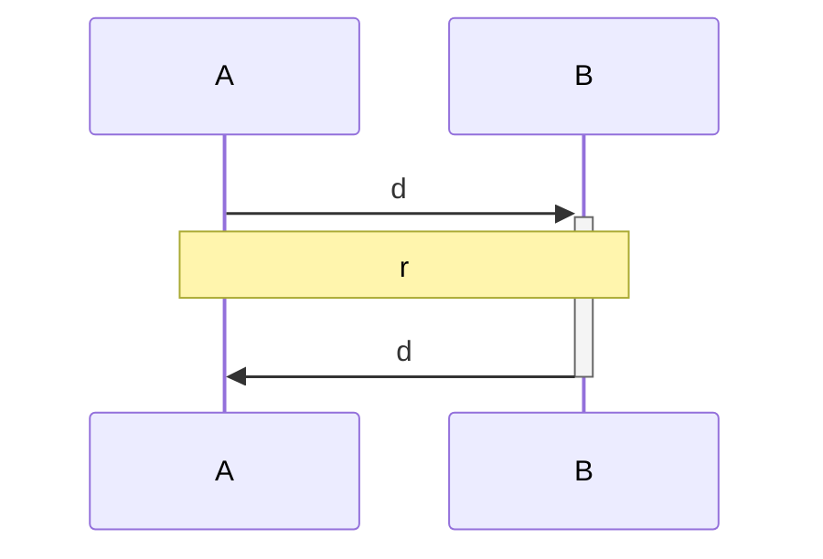
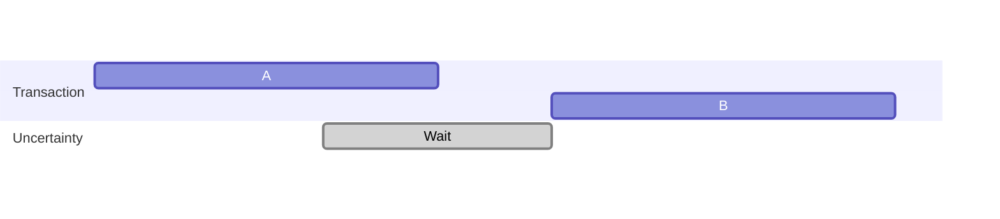

# Ch08 분산시스템의 골칫거리(결함과 부분 장애, 신뢰성 없는 네트워크, 신뢰성 없는 시계)

## 결함과 부분 장애

### 클라우드 컴퓨팅과 슈퍼컴퓨팅

- 단일 컴퓨터에서의 연산은 항상 같은 결과를 낸다(결정적이다 라고 한다).
- 분산 시스템에서는 부분적으로 예측할 수 없는 방식으로 동작할 수 있고(비결정적), 이를 **부분 장애(partial failure)** 라고 한다.

> 비결정성과 부분 장애 가능성이 분산 시스템을 다루기 어렵게 한다.

분산시스템에서는 항상 어딘가에 장애가 있다고 생각하는 것이 바람직하며, 이런 시스템을 설계할 때는 이러한 장애를 감내할 수 있도록 설계하는 것이 중요하다.

## 신뢰성 없는 네트워크

> 타임아웃에 "올바른" 값은 없으며 실험을 통해 결정해야 한다.

네트워크에서 오고가는 패킷은 중간에 어떻게 유실될지 파악하기가 어렵다.

1. 요청이 손실됐을 수 있다.
2. 요청이 큐에서 대기하다 나중에 전송될 수 있다.
3. 원격 노드에 장애가 생겼을 수 있다.
4. 원격 노드가 일시적으로 응답하기를 멈췄을 수 있다.
5. 원격 노드가 요청을 처리했지만 응답이 네트워크에서 손실됐을 수 있다.
6. 원격 노드가 요청을 처리했지만 응답이 지연되다가 나중에 전송될 수 있다.

이런 문제를 다루는 흔한 방법은 **타임아웃**이다.

### 현실의 네트워크 결함

네트워크 결함의 오류가 정의되고 테스트되지 않는다면 나쁜 일이 제멋대로 생길 수 있고 예측 불가능한 일이 발생할 수 있다.

반드시 네트워크 결함을 견뎌내도록(tolerating) 처리할 필요는 없다. 그냥 사용자에게 오류 메시지를 보여주는 것도 타당한 방법이다. 그러나 네트워크 문제에 어떻게 반응하는지 알고 시스템이 그로부터 복구할 수
있도록 보장해야 한다. 고의로 네트워크 문제를 유발하고 시스템의 반응을 테스트하는 것은 일리가 있다([[Chaos Monkey]]).

### 결함 감지

뭔가 잘못되면 스택의 어떤 수준에서 오류 응답을 받을지도 모르지만 일반적으로 아무 응답도 받지 못할 것이라고 가정해야 한다. 몇 번 재시도를 해보고 타임아웃이 만료되기를 기다렸다가 타임아웃 내에 응답을 받지 못하면
노드가 죽었다고 선언할 수 있다.

### 타임아웃과 기약 없는 지연

> **타임아웃만이 결함을 감지하는 확실한 수단**이라면 타임아웃은 얼마나 길어야 할까?

- 타임아웃이 길면? 노드가 죽었다고 선언될 때까지 기다리는 시간이 길어진다.
- 타임아웃이 짧으면? 일시적인 성능 저하에도 죽었다고 잘못 판단할 가능성이 높아진다.

성급하게 노드가 죽었다고 선언하면 문제가 된다. 노드가 어떤 동작을 실행하는 중에 다른 노드가 역할을 넘겨 받으면 그 동작을 두 번 실행하게 될지도 모른다. 다른 노드에 역할이 넘어가며 부하를 가중시킬 수도 있다.
시스템이 이미 높은 부하를 받고 있다면 전체적인 장애로 이어질 수 있다.

합리적인 타임아웃 시간을 생각해볼 때는 아래와 같은 그래프처럼 생각해볼 수 있다.

A 의 요청에 대한 응답은 $2d+r$ 의 시간 내에 받을 수 있다고 보장할 수 있다. 그러므로 $2d+r$ 의 시간을 타임아웃으로 사용하게는게 합리적이다.

유감스럽게도 많은 시스템이 이 중 어떠한 시간도 보장해주지 않는다. 비동기 네트워크는 **기약 없는 지연(unbounded delay)** 이 있고(패킷을 가능한 한 빨리 보내려고 하지만 도착하는 데 걸리는 시간에
상한치는 없다), 서부 구현은 대부분 어ㄸ너 최대 시간 내에 요청을 처리한다고 보장할 수 없다.

타임아웃이 너무 낮으면 왕복 시간이 순간적으로 급증하기만 해도 시스템의 균형을 깨트린다.

#### 네트워크 혼잡과 큐 대기

> 네트워크 패킷 지연의 변동성은 큐 대기 때문인 경우가 많다.

[[TCP]] 는 순서를 보장하기 위해 수신 서버로부터 ack 를 기다린다. window size 를 초과하는 [[Packet]] 은 수신 서버의 window size 에 여유가 생길 때까지 기다려야 한다.
애플리케이션에게는 패킷 손실이나 재전송이 보이지 않지만 그 결과로 생기는 지연은 보인다.

맵리듀스([[MapReduce]]) 같은 일괄 처리 작업부하는 네트워크 링크를 포화시키기 쉽다.

이런 대기는 네트워크 지연의 변동성에 영향을 준다.

이런 환경에서는 ==실험적으로 타임아웃을 선택==하는 수밖에 없다. 네트워크 왕복 시간의 분포를 측정하고 애플리케이션의 특성을 고려해서 적절한 트레이드오프를 결정할 수 있다.

더 좋은 방법은 고정된 타임아웃을 설정하는 대신 시스템이 지속적으로 응답 시간과 그들의 변동성(jitter)을 측정하고 관찰된 ==응답 시간 분포에 따라 타임아웃을 자동으로 조절==하게 하는 것이다. 파이 증가 장애
감지기([[Phi Accrual failure detector]])를 쓰면 된다. TCP 재전송 타임아웃도 비슷하게 동작한다.

### 동기 네트워크 대 비동기 네트워크

> 전화는 회선 교환(circuit-switch) 네트워크로, 회선은 고정된 양의 예약된 대역폭을 사용한다.

전화 네트워크에서 통화를 할 때는 회선(circuit)이 만들어진다. 통화를 하는 두 명 사이에 있는 전체 경로를 따라서 그 통화에 대해 고정되고 보장된 양의 대역폭이 할당된다. 회선은 통화가 끝날 때까지 유지된다.

이런 종류의 네트워크는 동기식이다. 통화당 공간이 이미 할당되어 있기 때문에 큐 대기 문제를 겪지 않는다. 큐 대기가 없으므로 네트워크 종단 지연 시간의 최대치가 고정돼 있다. 이를 **제한 있는 지연(bounded
delay)** 라고 한다.

#### 그냥 네트워크 지연을 예측 가능하게 만들 수는 없을까?

> 인터넷은 패킷 교환(packet-switch) 프로토콜이고, 네트워크 대역폭을 유동적으로 조절하며 사용하기 위한 방식이다.

인터넷은 순간적으로 몰리는 트래픽(bursty traffic)에 최적화되어 있다. 회선을 통해 파일을 전송하고 싶다면 대역폭 할당을 추정해야 한다.

- 너무 낮으면? 네트워크 용량을 쓰지 않고 남겨둔채로 전송이 불필요하게 느려진다.
- 너무 높으면? 회선이 구성되지 않는다. 회선 교환 네트워크는 대역폭 할당을 보장할 수 없다면 회선 생성을 허용하지 않기 때문이다.

그러므로 순간적으로 몰리는 데이터 전송에 회선을 쓰면 네트워크 용량을 낭비하고 전송이 불필요하게 느려진다. 반대로 TCP 는 가용한 네트워크 용량에 맞춰 데이터 전송률을 동적으로 조절한다.

[[Ethernet]], [[Netwrok Switch]]

결과적으로 타임아웃에 '올바른' 값은 없으며 실험을 통해 결정해야 한다.

## 신뢰성 없는 시계

> 네트워크 시간 프로토콜([[Network Time Protocol]], NTP)로 서버 그룹에서 보고한 시간에 따라 컴퓨터 시계를 조정할 수 있다.

개별 장비는 자신의 시계를 갖고 있다. 실제 하드웨어 장치로 보통 수정 발진기(quartz crystal oscillator)다. 이 장치는 완벽하게 정확하진 않아서 각 장비는 자신만의 시간 개념이 있으며 이는 다른
장비보다 약간 빠를 수도 느릴 수도 있다. 따라서 NTP 를 사용하여 서버 그룹에서 보고한 시간에 따라 컴퓨터 시계를 조정할 수 있게 한다.

### 단조 시계 대 일 기준 시계

현대 컴퓨터는 최소 두 가지 종류의 시계를 갖고 있다.

- 일 기준 시계(time-of-day clock)
- 단조 시계(monotonic clock)

#### 일 기준 시계

- 일반적인 바로 그 시계
- NTP 로 동기화
- 로컬 시계가 NTP 서버보다 너무 앞서면 강제로 리셋되어 과거 시점으로 거꾸로 뛰는 것처럼 보일 수 있다.
- 오래된 컴퓨터에서는 10ms 단위로 흐르는 거친 해상도. 다만 최근에는 별 문제가 되지 않는다.

#### 단조 시계

- 항상 앞으로만 흐른다 (어찌보면 당연하지만 일 기준 시계에서는 당연하지 않다).
- 두 값의 차이로 시간차를 알아낼 수 있다. 다만 절대적인 값은 의미가 없다.
- 두 대의 다른 컴퓨터에서 나온 단조 시계 값은 동일한 것을 의미하지 않는다(=비교에 의미가 없다).
- 해상도가 매우 좋다. 대부분의 시스템에서 마이크로초나 그 이하 단위로 측정할 수 있다.

==분산 시스템에서 경과 시간을 재는 데 단조 시계를 쓰는 것이 괜찮다.== 다른 노드의 시계 사이에 동기화가 돼야 한다는 가정이 없고 측정이 약간 부정확해도 민감하지 않기 때문이다.

### 시계 동기화와 정확도

일반적인 기대와는 달리 컴퓨터의 시계는 정확하지 않다.

- drift 현상이 생긴다.
- 로컬 시계가 NTP 서버와 너무 많은 시간 차이가 나면 동기화가 거부되거나 로컬 시계가 강제로 리셋될 수 있다. 리셋 전후로 시간이 거꾸로 흐른 것처럼 보일 수 있다.
- 노드와 NTP 서버 사이가 방화벽으로 막히면 잘못된 설정이 얼마 동안 알려지지 않을 수 있다.
- NTP 동기화도 결국 네트워크 지연이 발생한다.
- 최대 몇 시간 정도의 차이가 발생할 수 있다.
- 윤초를 고려하지 않고 설계된 시스템에서는 시간에 대한 가정이 망가질 수 있다.
- 가상 장비에서 하드웨어 시계가 함께 가상화돼서 CPU 코어가 가상 장비 사이에서 공유될 때 시계가 함께 멈출 수 있다.
- 모바일 장비나 임베디드 장비 등 제어할 수 없는 장치의 시계는 조작이 가능하기 때문에 전혀 믿을 수 없다.

아래 방법들을 사용해서 시계 정확도를 매우 높이는 것도 가능하다.

- GPS 수신기
- 정밀 시간 프로토콜([[Precision Time Protocol]], PTP)
- 세심한 배포 및 모니터링

### 동기화된 시계에 의존하기

> 시계가 잘못된 상태라는 것을 인지하기는 쉽지 않다.

장비의 CPU 에 결함이 있거나 네트워크가 잘못 설정되면 그 장비는 전혀 동작하지 않아서 빠르게 발견되고 수정될 가능성이 높지만, 시간은 그렇지 않다. 조용하고 천천히 데이터가 유실될 수 있다.

따라서 동기화된 시계가 필요한 소프트웨어를 사용한다면 필수적으로 모든 장비 사이의 시계 차이를 조심스럽게 모니터링해야 한다.

#### 이벤트 순서화용 타임스탬프

> 최종 쓰기 승리(last write wins, LWW) 전략에서는 클라이언트 간의 시간 지연으로 인해 갱신 손실이 발생할 수 있다.

기기마다 **"최근" 값은 로컬 시계에 의존하고 있고, 그 시계는 틀릴 수 있다는 사실을 아는 것이 중요**하다.

**논리적 시계(logical clock)** 는 카운터를 기반으로 하며 이벤트 순서화의 안전한 대안이다. 논리적 시계는 이벤트의 상대적인 순서만 측정한다.

#### 시계 읽기는 신뢰 구간이 있다

#### 전역 스냅숏용 동기화된 시계

$A = [A_{earliest},A_{latest}]$ 와 $B=[B_{earliest},B_{latest}]$ 라는 두 구간이 겹치지 않는다면,

$$
A_{earliest} < A_{latest} < B_{earliest} < B_{latest}
$$

을 만족한다. 의심의 여지 없이 B 가 A 보다 나중에 실행됐다.

트랜잭션 타임스탬프가 인과성을 반영하는 것을 보장하기 위해 스패너는 읽기 쓰기 트랜잭션(A)을 커밋하기 전에 의도적으로 신뢰 구간의 길이만큼 기다린다. 대기 시간을 줄이기 위해서는 불확실성 구간을 가능하면 작게
유지해야 한다.

### 프로세스 중단

#### 응답 시간 보장

#### 가비지 컬렉션의 영향을 제한하기
